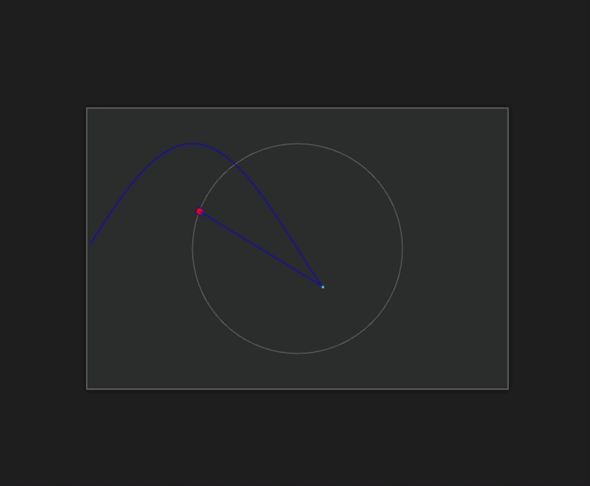

# Sine Graph Simulation



This is a simple JavaScript simulation of a sine graph plotted alongside a moving point on a circle. It's implemented using HTML5 Canvas and JavaScript.

## Demo

You can see the simulation in action by visiting [this link]( https://dyanix.github.io/Sine-graph/).

## Features

- Visualizes a sine wave graph.
- Animated point moving on a circle.
- Real-time graph plotting.

## Table of Contents

- [Getting Started](#getting-started)
- [Usage](#usage)
- [Customization](#customization)
- [License](#license)
- [Acknowledgments](#acknowledgments)
- [Author](#author)

## Getting Started

1. Clone this repository:

   ```bash
   git clone https://github.com/your-username/sine-graph-simulation.git


## Usage

The simulation consists of a circle with a moving point and a sine graph. The point moves around the circle, and its position is reflected in the sine graph.

## Customization

You can customize the simulation by adjusting the following parameters in the `script.js` file:

- `circleRadius`: Adjust the radius of the circle.
- `graphScale`: Change the scale of the graph animation.
- Canvas dimensions: Modify the canvas dimensions in the HTML file.

## License

This project is licensed under the MIT License - see the [LICENSE](LICENSE) file for details.

## Acknowledgments

This simulation is created as a learning exercise and can be used as a starting point for more complex visualizations.

## Author

- [Dyanesh](https://github.com/dyanix)

